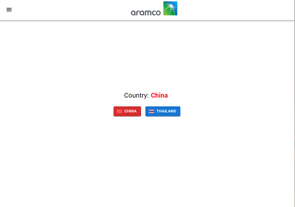

# Aramco Dashboard App Deployment
### Pre-requisites: Have npm or yarn installed [(node version >= 16.0.0)](https://nodejs.org/en/download/)
1. Open up your terminal and go to the root of your project folder
2. Run command: yarn install / npm install
    - It will take awhile to download all the necessary packages
      - Extra: You can take a look at what packages are installed in package.json
3. Run command: yarn start / npm start
    - It takes awhile to create the development server
4. Once done, your default browser will automatically open a tab to [http://localhost:3000](http://localhost:3000)
5. You should be able to see this:
   
